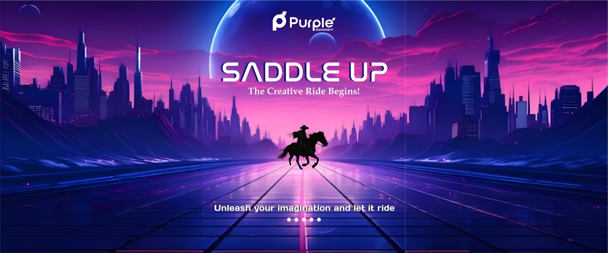

<p align="center">
  
</p>


# Project Title  
_A short and catchy tagline or one-liner about your project_

Describe what your project is, what it does, and why it's awesome. Highlight its purpose and uniqueness.


## Creators

1. [Name 1](https://github.com/The-Purple-Movement/saddle-up)  


## Demo Showcase

[Watch Walkthrough](Link Here)

You can also embed a short demo video or animation here if you’d like!


## Behind the Scenes

1. Brief overview of how your project works  
2. Key workflows, logic, or features  
3. Any creative approach or process worth sharing


## Tech & Tools

| Tool / Library | Version |
|----------------|---------|
| ExampleLib     | 1.2.3   |


## Setup Instructions

Explain how someone can set up the project on their local machine:

```bash
# Clone the repository
git clone https://github.com/your-username/your-repo.git

# Go to project directory
cd your-repo

# Install dependencies
npm install
